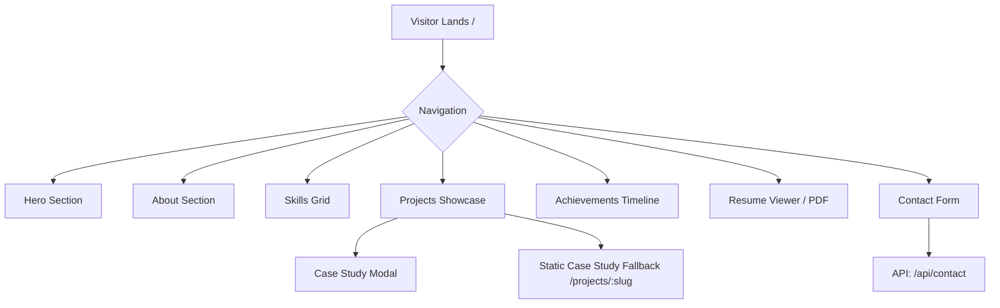
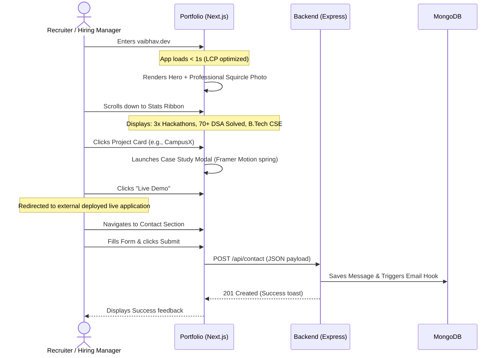
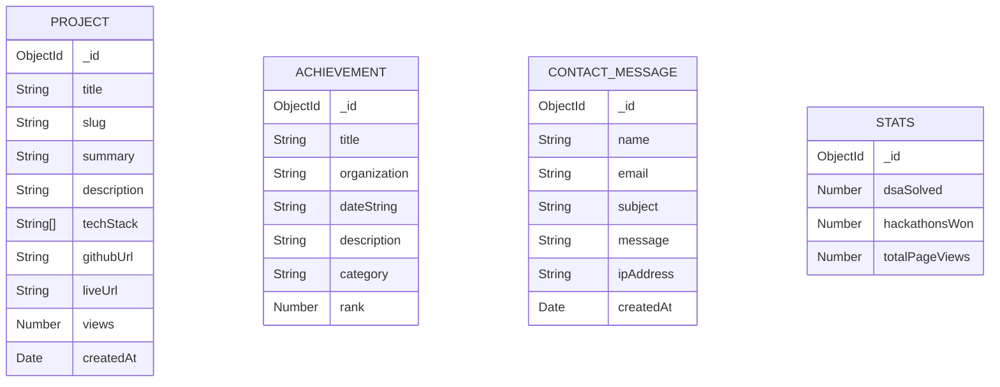

# VAIBHAV.DEV Professional Portfolio Ecosystem - Architectural Specification

This document details the production-grade architecture, design specification, and development blueprint for **VAIBHAV.DEV**, a premium, modern SaaS-style professional portfolio website for Vaibhav Vikas Sawarbandhe.

The ecosystem is split into two independent repositories to separate concerns:
1. `portfolio-frontend`: High-performance, SEO-optimized Next.js 15 user interface.
2. `portfolio-backend`: Secure and light Node.js/Express REST API with MongoDB.

---

## 1. Executive Summary

### Context & Vision
Vaibhav Vikas Sawarbandhe is a B.Tech Computer Science Engineering student (2023–2027), Full Stack Developer, 3x Hackathon Winner, and Startup Enthusiast based in Nagpur, India.
This portfolio serves as his primary digital gateway for:
* **Recruiters & Placement Officers** evaluating core engineering, Full Stack web capabilities, and DSA metrics.
* **Startup Co-founders & Innovators** looking for agile, execution-oriented development partners.
* **Freelance Clients** seeking premium, clean, high-performance web applications.

### Design Direction
We discard childish, over-animated, or futuristic "cyberpunk/space" aesthetics in favor of a **premium, clean, minimal SaaS product design**. 
* **Primary Theme:** Custom dark theme with deep slate backdrops, electric blue accents, and subtle purple/indigo gradients.
* **Typography:** Inter (body, clean, readable) combined with Poppins (headings, geometric, professional).
* **Motion Design:** Micro-interactions (hover shifts, grid-card glows, spring-loaded buttons, intersection fade-ins) to feel responsive and premium.

---

## 2. Site Map & Navigation



### Route Structure
* `/` (Landing Page): Consolidated single-page architecture containing all key sections with scroll-linked navigation.
* `/projects/[slug]` (Static Fallback Page): Deep SEO page matching the interactive modal's content, allowing recruiters to share direct links to individual project writeups.
* `/resume` (Redirect/Direct Asset): Instant response serving `/public/assets/resume.pdf` with appropriate content-disposition headers.

---

## 3. User Journey



---

## 4. Complete Information Architecture

The website organizes information hierarchically to maximize retention:

```
[Level 1: Visual Identity & Pitch]
├── Brand Identity: VAIBHAV.DEV
├── Hero Headline: Professional Focus (Full Stack & Startup Building)
└── Quick Stats Bar: Instant Credibility Metrics (Hackathons, DSA, B.Tech)

[Level 2: The Core Proof]
├── About: Professional narrative, background, and academic path
├── Skills Matrix: Categorized tech stack (Languages, Frontend, Backend, Tools)
└── Projects Grid: Curated card layouts (CampusX, Airbnb Clone, Portfolio)

[Level 3: Validation & CTA]
├── Achievements Timeline: Hackathons, Startup Arena, Technical Quizzes
├── Interactive Resume: Read online or download direct PDF
└── Contact Ecosystem: Validated message terminal & direct email channel
```

---

## 5. Frontend Folder Structure (`portfolio-frontend`)

We use a modern Next.js 15 directory structure using the `src` convention and App Router:

```
portfolio-frontend/
├── src/
│   ├── app/
│   │   ├── layout.tsx             # Root layout with fonts, provider injection, metadata
│   │   ├── page.tsx               # Main SPA landing page with scroll sections
│   │   ├── projects/
│   │   │   └── [slug]/
│   │   │       └── page.tsx       # Dynamic SEO-fallback project case study page
│   │   ├── api/
│   │   │   ├── contact/
│   │   │   │   └── route.ts       # Frontend route handler (proxies backend or hits DB)
│   │   │   └── stats/
│   │   │       └── route.ts       # Serves real-time dynamic stats (DSA, page views)
│   │   └── providers.tsx          # Context providers (Theme, Toast, Tooltip)
│   ├── components/
│   │   ├── ui/                    # Atomic Tailwind components (Shadcn UI base)
│   │   │   ├── button.tsx
│   │   │   ├── card.tsx
│   │   │   ├── dialog.tsx
│   │   │   ├── input.tsx
│   │   │   ├── textarea.tsx
│   │   │   ├── tooltip.tsx
│   │   │   └── badge.tsx
│   │   ├── sections/              # Section components
│   │   │   ├── hero.tsx
│   │   │   ├── about.tsx
│   │   │   ├── skills.tsx
│   │   │   ├── projects.tsx
│   │   │   ├── achievements.tsx
│   │   │   ├── resume.tsx
│   │   │   ├── contact.tsx
│   │   │   └── footer.tsx
│   │   ├── shared/                # Layout and composite components
│   │   │   ├── navbar.tsx         # Floating glass navbar
│   │   │   ├── project-card.tsx   # Reusable project card
│   │   │   ├── case-study-modal.tsx
│   │   │   ├── stat-counter.tsx   # Animating stat number incrementer
│   │   │   └── section-wrapper.tsx # Handles standard layouts, paddings, anchors
│   │   └── animations/
│   │       ├── fade-in.tsx        # Framer Motion wrapper for entry animations
│   │       └── hover-card.tsx     # Custom 3D tilt/hover scale wrapper
│   ├── hooks/
│   │   ├── use-active-section.ts  # Intersection Observer for scroll-linked navigation
│   │   └── use-scroll-position.ts # Tracks window scroll for navbar glass opacity
│   ├── lib/
│   │   ├── api.ts                 # Axios/Fetch wrapper to connect to backend
│   │   └── utils.ts               # Standard Tailwind merge/clsx utility
│   ├── types/
│   │   └── index.ts               # TypeScript Interfaces (Project, Achievement, etc.)
│   └── styles/
│       └── globals.css            # Custom CSS properties, scrollbars, and keyframes
├── public/
│   ├── assets/
│   │   ├── profile.jpg            # Professional profile photo (optimized, webp layout)
│   │   ├── resume.pdf             # Static downloadable resume asset
│   │   └── projects/              # Project thumbnails
│   │       ├── campusx.webp
│   │       ├── airbnb-clone.webp
│   │       └── portfolio.webp
│   └── favicon.ico
├── tailwind.config.ts
├── tsconfig.json
├── package.json
└── next.config.ts
```

---

## 6. Backend Folder Structure (`portfolio-backend`)

A robust Node.js, Express.js, and MongoDB MVC structure:

```
portfolio-backend/
├── src/
│   ├── config/
│   │   └── db.js                  # Mongoose connection client & configs
│   ├── controllers/
│   │   ├── projectController.js   # Fetches project metadata and increments view counts
│   │   ├── achievementController.js # Handles achievement list operations
│   │   ├── contactController.js   # Validates form, stores message, emails Vaibhav
│   │   └── statsController.js     # Dynamically compiles aggregate metrics
│   ├── models/
│   │   ├── Project.js
│   │   ├── Achievement.js
│   │   ├── ContactMessage.js
│   │   └── Stats.js               # Tracks visitor counters & live DSA counts
│   ├── routes/
│   │   ├── projectRoutes.js
│   │   ├── achievementRoutes.js
│   │   ├── contactRoutes.js
│   │   └── statsRoutes.js
│   ├── middleware/
│   │   ├── auth.js                # Token verification (for future management dashboard)
│   │   ├── errorHandler.js        # Catch-all unified error structure
│   │   └── rateLimiter.js         # Limits contact form spam (IP-based limit)
│   ├── utils/
│   │   ├── validation.js          # Joi/Zod schema verification
│   │   └── mailer.js              # Nodemailer setup for instant email alert
│   ├── app.js                     # Express application definition
│   └── server.js                  # Entry point (listens on PORT)
├── .env.example
├── .gitignore
├── package.json
└── README.md
```

---

## 7. Component Breakdown

| Component | Target File | Description | Dynamic Behavior |
|---|---|---|---|
| **Navbar** | `navbar.tsx` | Glassmorphism fixed bar with dynamic highlight | Updates active section link based on scroll position. Blur effect scales with scroll. |
| **Section Wrapper** | `section-wrapper.tsx` | Reusable section spacing, anchor ID hooks | Incorporates `framer-motion` scroll-trigger fade-in/slide-up animations. |
| **Profile Photo** | `hero.tsx` | Interactive photo element | Glowing radial backdrop, slight 3D hover rotation, responsive sizing. |
| **Stat Card** | `stat-counter.tsx` | Interactive counter for metrics | Triggers counting animation from `0` to target when entering viewport. |
| **Project Card** | `project-card.tsx` | Interactive card displaying project details | Zoom image on hover, reveal buttons, opens Case Study modal on click. |
| **Case Study Modal**| `case-study-modal.tsx`| Overlay Dialog (Radix/Shadcn) | Animates smoothly, displays tabs for Description, Architecture, Features. |
| **Skill Badge** | `skills.tsx` | Categorized interactive cards | Hover expands border color to accent gradient, shows short details tooltip. |
| **Timeline Node** | `achievements.tsx` | Elegant vertical line with nodes | Fades in sequence (staggered animation) as visitor scrolls. |
| **Contact Form** | `contact.tsx` | Clean input field grid | Field validation states, submitting animation, toast response feedback. |

---

## 8. Page-by-Page / Section-by-Section Blueprint

### Color & Typography Theme (Tailwind Configuration)
```typescript
colors: {
  background: "#0F172A", // Deep charcoal slate
  surface: "#1E293B",    // Card background slate
  primary: "#2563EB",    // Vibrant Blue
  accent: "#7C3AED",     // Vibrant Indigo
  text: "#F8FAFC",       // Soft Off-White
  textMuted: "#94A3B8"  // Slate Gray
}
```

---

### Section 1: Hero Section

* **Objective:** Capture visitor attention, display developer identity, and present primary call-to-actions.
* **Layout:** Two-column grid layout on desktop (`lg:grid-cols-2`), single-column stacked on mobile.
* **Headline:** "Engineering Scalable Software. Building Startup Solutions."
* **Subheadline:** "Full Stack Developer specializing in high-performance web applications, robust backends, and rapid product development."
* **CTAs:**
  1. Primary Button (Solid Primary Blue): `View Projects` (scrolls to `#projects`)
  2. Secondary Button (Outlined/Glass Accent): `Download Resume` (links to `/public/assets/resume.pdf`)

#### Professional Photo Placement Strategy
```
+-------------------------------------------------------------+
|                                                             |
|  [VAIBHAV.DEV]                  [About] [Projects] [Contact]|
|                                                             |
|  Engineering Scalable           +------------------------+  |
|  Software. Building             |    /================\  |  |
|  Startup Solutions.             |   /  Profile Photo   \ |  |
|                                 |   \   (Squircle)     / |  |
|  Full Stack Developer...        |    \================/  |  |
|                                 +------------------------+  |
|  [View Projects] [Resume]       Subtle indigo glow ring    |
|                                                             |
+-------------------------------------------------------------+
```
* **Dimensions:**
  * **Desktop:** `w-[350px] h-[350px]` (Max width wrapper to prevent scaling deformation).
  * **Mobile:** `w-[240px] h-[240px]` (Centered, padding top/bottom to separate headers).
* **Responsive Details:**
  * Desktop: Placed right-aligned, side-by-side with headline.
  * Mobile: Placed at the top, centered, preceding the main headline to establish immediate connection.
* **Aesthetics:**
  * Shape: Squircle (smooth rounded square, border-radius `3xl`/`24%`).
  * Effects: Border width `2px` colored `#7C3AED` (Accent) with a radial-gradient pulse animation backdrop. On hover, the image scales up `1.03` with a smooth 3D tilt rotation relative to mouse position.
  * Next.js Image Component attributes: `priority={true}` (to prevent LCP layout shift), `placeholder="blur"`.

---

### Section 2: About Section

* **Objective:** Introduce Vaibhav's academic background, developer philosophy, and career objectives.
* **Layout:** Grid structure containing an editorial paragraph and a set of stats cards.
* **Content:**
  * B.Tech Computer Science Engineering student at Priyadarshini Bhagwati College of Engineering, Nagpur (Class of 2027).
  * Focuses on building modular code bases, participating in hackathons, and developing digital platforms that support real-world collaboration.
* **Stats Cards Grid:**
  * Card A: "3x Hackathon Winner" -> Icon: Trophy, Detail: Local and regional hackathons.
  * Card B: "70+ DSA Problems" -> Icon: Code, Detail: Solved in C++ and Python on LeetCode/GeeksforGeeks.
  * Card C: "Startup Enthusiast" -> Icon: Rocket, Detail: Winner of Startup Arena PBCOE.

---

### Section 3: Skills Section

* **Objective:** Detail professional technical capabilities without using arbitrary percentage progress bars.
* **Layout:** 4-column dynamic grid grouping similar technologies.
* **Visual Presentation Strategy:**
  * Each group resides in a distinct glassmorphic card (surface `#1E293B`, subtle border).
  * Technologies are rendered as solid background badges (`#0F172A`) containing the brand icon and title.
  * On hover, badges scale up and outline shifts to accent colors.
* **Skill Categories:**
  1. **Languages:** C++, Python, JavaScript, TypeScript
  2. **Frontend:** React.js, Next.js, Tailwind CSS, Framer Motion, HTML/CSS
  3. **Backend & DB:** Node.js, Express.js, MongoDB, REST APIs
  4. **Tools & Workflow:** Git, GitHub, VS Code, npm/yarn

---

### Section 4: Projects Section

* **Objective:** Highlight key developmental accomplishments with clean presentation.
* **Layout:** 3-column responsive grid matching project cards.

#### Card Structure & Information Hierarchy
1. **Visual Layer (Top):** Project image (optimized webp) with overlay gradient. On hover, reveals a quick-view tag.
2. **Title Layer:** H3 heading, system-level project name, and relative date.
3. **Short Description:** One-sentence summary highlighting the technical accomplishment.
4. **Technology Badges:** Dynamic mapping of languages/frameworks used (e.g., `Next.js`, `Express`, `MongoDB`).
5. **Action Row (Bottom):** Two minimal icon-buttons:
   * "GitHub Source" (Icon button)
   * "Live Deployment" (Icon button)
   * "Case Study" text button (Triggers the detailed modal).

#### Case Study Modal Detail (Dialog Overlay)
* **Trigger:** Clicking a project card opens a Radix Dialog modal.
* **Layout:** Split panel (Left: Image gallery + quick technical metadata; Right: Structured case study documentation).
* **Tabs:**
  * **Overview:** The problem statement, target audience, and final product success.
  * **Architecture & Features:** Technical choices, database schemas, and feature breakdown.
  * **Challenges & Learnings:** An honest review of what broke during development and how it was resolved (highly valued by recruiters).

---

### Section 5: Achievements Section

* **Objective:** Provide validation of technical capability and execution.
* **Layout:** Vertically oriented timeline tracker.
* **Items:**
  1. **Startup Arena Winner:** Pitching and developing the business logic and tech prototype for a startup venture.
  2. **3x Hackathon Winner:** Designing solutions under tight deadlines (building fast prototypes, coordinate frontend/backend under pressure).
  3. **2x Technical Quiz Winner:** Demonstrating solid theoretical knowledge of algorithms, networking, and databases.
  4. **70+ DSA Solved:** Algorithmic optimization milestones.

---

### Section 6: Resume Section

* **Objective:** Give instant access to standard screening documentation.
* **Layout:** Centered professional banner.
* **Visuals:** Embedded preview wrapper of the resume template with overlay action buttons:
  * Button 1: "Download PDF" (downloads `resume.pdf`).
  * Button 2: "View Fullscreen" (opens the asset path in a new browser tab).

---

### Section 7: Contact Section

* **Objective:** Convert visitor interest into direct inquiries.
* **Layout:** Grid split (Left: Email detail `svv5498@gmail.com` with copy-to-clipboard button and social anchors; Right: Dynamic Contact Form).
* **Form Inputs:**
  * Full Name (required)
  * Email Address (required, verified formatting)
  * Subject (required)
  * Message (required, textarea with character countdown limit)
* **Form Logic:**
  * Disables input buttons during submission sequence.
  * Displays loading spinners.
  * Integrates a success toast message upon `201` return from backend.

---

## 9. API Architecture

All endpoints accept and return JSON. The API uses standard REST methods.

```
API Base URL: https://api.vaibhav.dev/api/v1
```

### Endpoints Specification

#### 1. POST `/api/v1/contact`
* **Description:** Submit a recruiter/client message.
* **Rate Limit:** 3 submissions per IP address per hour.
* **Payload Structure:**
```json
{
  "name": "Jane Doe",
  "email": "jane.doe@company.com",
  "subject": "Urgent: Interview Request for Next.js role",
  "message": "Hello Vaibhav, we liked your CampusX project and want to invite you to our B.Tech internship process."
}
```
* **Success Response (201 Created):**
```json
{
  "success": true,
  "message": "Your message was sent successfully. Vaibhav will contact you shortly."
}
```
* **Failure Response (400 Bad Request):**
```json
{
  "success": false,
  "errors": [
    { "field": "email", "message": "Please enter a valid business email." }
  ]
}
```

#### 2. GET `/api/v1/projects`
* **Description:** Retrieve dynamic list of projects with real-time metadata.
* **Success Response (200 OK):**
```json
{
  "success": true,
  "data": [
    {
      "id": "proj_01",
      "title": "CampusX",
      "slug": "campus-x",
      "summary": "Student-focused collaboration and milestone platform.",
      "techStack": ["Next.js", "Node.js", "MongoDB", "TailwindCSS"],
      "githubUrl": "https://github.com/vaibhav/campusx",
      "liveUrl": "https://campusx.dev",
      "views": 154
    }
  ]
}
```

#### 3. GET `/api/v1/stats`
* **Description:** Aggregates portfolio metrics.
* **Success Response (200 OK):**
```json
{
  "success": true,
  "data": {
    "dsaSolved": 72,
    "hackathonsWon": 3,
    "projectsCompleted": 3,
    "totalPageViews": 2405
  }
}
```

---

## 10. Database Schema Design

MongoDB database mapping modeled via Mongoose.



### 1. Project Schema
```javascript
const projectSchema = new mongoose.Schema({
  title: { type: String, required: true },
  slug: { type: String, required: true, unique: true, index: true },
  summary: { type: String, required: true },
  description: { type: String, required: true }, // Long markdown text
  techStack: [{ type: String }],
  githubUrl: { type: String },
  liveUrl: { type: String },
  views: { type: Number, default: 0 },
  createdAt: { type: Date, default: Date.now }
});
```

### 2. Contact Message Schema
```javascript
const contactMessageSchema = new mongoose.Schema({
  name: { type: String, required: true, trim: true },
  email: { type: String, required: true, trim: true, lowercase: true },
  subject: { type: String, required: true },
  message: { type: String, required: true },
  ipAddress: { type: String },
  createdAt: { type: Date, default: Date.now }
});
```

---

## 11. Responsive Design Plan

The design follows a strict mobile-first pattern, ensuring zero horizontal scrolling and fast touch response:

| Breakpoint | Target Width | Layout Behavior changes | Custom UI Adaptation |
|---|---|---|---|
| **Mobile (sm)** | `< 640px` | Single column grid stack. | Floating mobile bottom menu or full-screen hamburger layout. Fixed image width 240px. |
| **Tablet (md)** | `640px - 1024px` | Hero scales columns (stacked layout with large text). Projects change to 2 columns. | Sidebar/drawer nav turns into standard horizontal header links. |
| **Laptop (lg)**| `1024px - 1280px`| Hero shifts to two-column grid. Projects change to 3 columns. Profile image shifts to desktop right. | Full glassmorphism nav menu appears. Hover scale and cursor glow effects enabled. |
| **Desktop (xl)**| `1280px - 1536px`| Main container capped at max-width `1280px` to maintain visual margins. | Padding and container alignments fixed. |
| **Ultra Wide**| `> 1536px` | Content is centered. Outer grid paddings auto-expand to prevent text lines stretching too far. | Side rails displays decorative background code accents. |

---

## 12. SEO Plan

To guarantee a **100/100 SEO score** on Google Lighthouse, we implement:

### Meta Structure
* **Meta Title:** `Vaibhav Vikas Sawarbandhe | Full Stack Developer & Engineering Student`
* **Meta Description:** `Portfolio of Vaibhav Vikas Sawarbandhe. B.Tech Computer Science Engineering student, Full Stack Developer, and 3x Hackathon Winner specializing in Next.js, Node.js, and MongoDB.`

### Open Graph Strategy
* **OG Title:** `Vaibhav Vikas Sawarbandhe | Full Stack Developer`
* **OG Description:** `Explore CampusX, Airbnb clone, and other software engineering projects built by B.Tech CSE student Vaibhav Vikas Sawarbandhe.`
* **OG Image:** `/public/assets/og-image.png` (Dimensions: `1200x630px` containing branding, profile photo, and core credentials).

### Structured Data (JSON-LD) - Embedded in `/src/app/layout.tsx`
```json
{
  "@context": "https://schema.org",
  "@type": "Person",
  "name": "Vaibhav Vikas Sawarbandhe",
  "jobTitle": "Full Stack Developer",
  "url": "https://vaibhav.dev",
  "address": {
    "@type": "PostalAddress",
    "addressLocality": "Nagpur",
    "addressRegion": "Maharashtra",
    "addressCountry": "India"
  },
  "colleague": "Priyadarshini Bhagwati College of Engineering",
  "sameAs": [
    "https://github.com/vaibhav-sawarbandhe",
    "https://linkedin.com/in/vaibhav-sawarbandhe"
  ]
}
```

---

## 13. Performance Plan

To achieve the targeted **95+ (Performance) and 100 (Accessibility, Best Practices, SEO)** scores:

1. **Asset Optimization:**
   * Images: All static graphics and screenshots converted to `.webp` format. Renders images using Next.js `next/image` with explicit width/height dimensions.
   * Fonts: Use standard Google fonts (Poppins, Inter) via `next/font/google` to embed fonts inside CSS without external network requests.
2. **Bundle Size Control:**
   * Implement dynamic routing and lazy load the modal dialog overlay component (`next/dynamic` import for the `Case Study Modal`).
   * Keep framer-motion sizes small (import only required items, use `mcp-motion` / `domAnimation` bundle to reduce JS load size).
3. **Database & API Optimization:**
   * Set indexes on MongoDB fields that are queried frequently (`slug` on Project, `createdAt` on Messages).
   * Inject compression middleware (`compression`) into Express backend to compress JSON payloads.

---

## 14. Development Roadmap

```
Phase 1: Setup & Data Schemas (Days 1-3)
├── Setup Next.js 15 template with Tailwind CSS & Shadcn UI configuration
├── Set up Node.js server with Mongoose mappings
└── Seed database with default Project & Achievement objects

Phase 2: Backend API & Email Services (Days 4-6)
├── Establish REST endpoints for Projects, Stats, and Contacts
├── Implement rate-limiter & contact input validator
└── Configure email service webhook using Nodemailer

Phase 3: Frontend Layout & Scroll Interface (Days 7-10)
├── Construct layout wrappers, standard glass-navigation, and Hero structure
├── Integrate static layout with responsive photo squircle
└── Build Skills grid & Projects grid using Framer Motion micro-animations

Phase 4: Optimization, Case Studies, & Launch (Days 11-14)
├── Add Case Study Dialog overlays with dynamic tabs
├── Integrate real-time stats with API endpoints
└── Run Lighthouse diagnostics to secure 95+ target score
```
